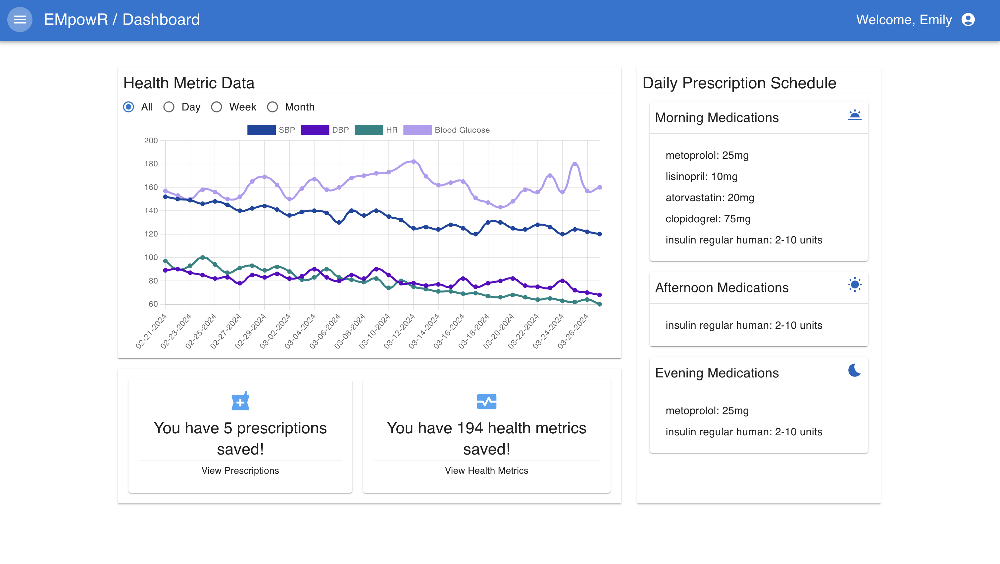

# EMpowR

Revolutionize Your Health Management. Effortlessly manage your prescriptions, track your health data, and stay healthy with our easy-to-use app. Take control of your health journey with EMpowR: Our at home electronic medical record streamlines medication management, providing peace of mind and better health outcomes.

## Demo
[Visit Loom for a brief video demo](https://www.loom.com/share/ba7959c85ce84475acad6320efda1948) 

## Getting Started

Once you have the repo forked and cloned down to your local machine, open your terminal and confirm that you are in the parent directory of the repo, then.

    cd server

    pipenv install

    pipenv shell

This command wil install all server side dependencies that are needed for the project and start the virtual environment for your application.

Confirm you are still within your server folder, if you are not, cd into it and run the following.

    flask db init

    flask db migrate -m 'initial'

    flask db upgrade head

    python scraper.py

    python seed.py
    
    python app.py

The above commands will initialize the database, seed it, along with start the backend database to be used.

Next, we need to get the client side of things up and running. Open a new terminal and enter the following. 

    cd client

    npm install

If you have completed the server side commands and have the server side up and running in another terminal, you are ready to start the app! In the same client terminal, run the following!

    npm start

## Future Development

- Implement Alerts system that prompts users to contact their healthcare provider if an abnormal Health Metric is recorded
- Initiate Reminders to prompt users to take medications when they are due
- Expand Medication database

## Collaboration

If you are interested in collaborating on this project or have any questions or suggestions, reach out and let's work together to improve patient care!
